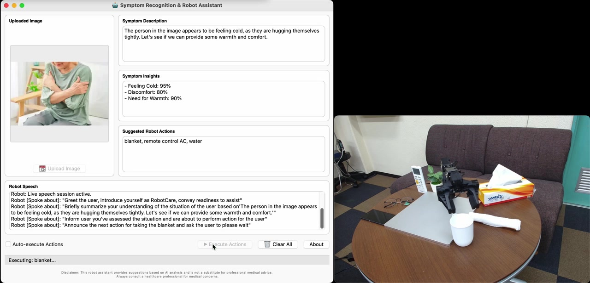

# Proactive Robot Assistance: Inferring User Needs via Pose Analysis with a VLM

[](https://www.python.org/downloads/)
[](https://deepmind.google/technologies/gemini/)
[](https://emanual.robotis.com/docs/en/platform/openmanipulator_x/overview/)

A **command-free** proactive robot assistance system that observes a user's body language through a camera, infers their unspoken needs using a Vision-Language Model (Google Gemini 2.0 Flash), and autonomously delivers physical assistance using an OpenManipulator-X robot arm -- all without any verbal or typed command.

> **First Two Month Project (FTMP)** -- University of Tsukuba, Graduate School of Science and Technology
> **Author:** Muhammad Arifin (D1 | 202530195) | **Supervisor:** Prof. Fumihide Tanaka

---

## Demo

[](https://github.com/mdarifin15/proactive-robot-pose-vlm/releases)

> **Click the image above to visit the Releases page and download the demo video.** The robot observes a user's pose, infers their need via Gemini 2.0 Flash, picks up the appropriate item, and delivers it while speaking naturally.

---

## Dataset Samples

The system is evaluated on 6 scenarios representing different user needs:

<table>
  <tr>
    <td align="center"><br><b>Thirst</b><br><code>water</code></td>
    <td align="center"><br><b>Cold / Allergies</b><br><code>tissue</code></td>
    <td align="center"><br><b>Feeling Hot</b><br><code>remote control AC</code></td>
  </tr>
  <tr>
    <td align="center"><br><b>Feeling Cold</b><br><code>blanket</code></td>
    <td align="center"><br><b>Difficulty Seeing</b><br><code>glasses</code></td>
    <td align="center"><br><b>Fall / Emergency</b><br><code>emergency call</code></td>
  </tr>
</table>

---

## How It Works

```
Camera Image ──> Perceptual Reasoning ──> Embodied Action ──> Task Execution
                 (Gemini 2.0 Flash)       (Action ranking)    (Arm + Speech)
```

1. **Perceive** -- The VLM analyzes a camera image to identify the user's pose, body language, and surrounding objects
2. **Reason** -- The model infers unspoken needs and selects relevant assistive actions (e.g., water, tissue, blanket)
3. **Act** -- The robot arm picks up the item, delivers it to the user, and speaks naturally using the Gemini Live API

### Supported Actions

| Action | Scenario |
|--------|----------|
| `water` | Thirst / Dehydration |
| `tissue` | Cold / Allergies |
| `blanket` | Feeling Cold |
| `glasses` | Difficulty Seeing |
| `remote control AC` | Feeling Hot |
| `emergency call` | Fall / Physical Emergency |

---

## Quick Start

### Prerequisites

- Python 3.10+
- ROBOTIS OpenManipulator-X connected via USB
- Google Gemini API key (obtain from Google AI Studio)

### Installation

```bash
git clone https://github.com/mdarifin15/proactive-robot-pose-vlm.git
cd proactive-robot-pose-vlm

python -m venv .venv
source .venv/bin/activate        # Linux/Mac

pip install -r requirements.txt

cp .env.example .env
# Edit .env and add your GEMINI_API_KEY
```

### Configure Hardware

Edit `config/robot_hardware_config.yaml` and set your serial port:
```yaml
connection_settings:
  device_name: "/dev/ttyUSB0"    # Linux
```

### Teach Robot Motions (first time only)

```bash
sudo .venv/bin/python src/teach_paths.py
```

Physically guide the arm to record pick-and-deliver paths for each action label.

### Run

```bash
python src/main.py
```

Upload an image in the GUI, and the system will analyze the user's condition and execute the suggested actions.

---

## Project Structure

```
proactive-robot-pose-vlm/
├── src/                        # Python source code (12 modules)
│   ├── main.py                 # Entry point
│   ├── robot_gui.py            # PyQt6 GUI
│   ├── robot_action.py         # QThread workers (analysis + action)
│   ├── llm_analyzer.py         # Gemini vision analysis
│   ├── tts_handler.py          # Gemini Live API speech
│   ├── openmanipulator_x_control.py  # Robot orchestrator
│   ├── arm_controller.py       # 4-joint arm control
│   ├── gripper_controller.py   # Gripper control
│   ├── dxl_sdk_interface.py    # Dynamixel SDK wrapper
│   ├── teach_paths.py          # Kinesthetic teaching
│   ├── run_taught_path.py      # Path playback
│   └── path_smoother.py        # Savitzky-Golay smoothing
├── config/                     # YAML configurations
├── data/                       # Taught motion paths
├── assets/                     # Presentation, dataset images, demo videos
└── docs/                       # Full documentation
```

---

## Results

Evaluated on **30 images** across 6 scenarios, each processed 3 times (90 total trials):

| Metric | Value |
|--------|-------|
| **Average VLM Inference Accuracy** | **90.35%** |
| **Robot Task Execution Success** | **96.66%** |

| Category | Accuracy |
|----------|----------|
| Fall / Physical Emergency | 100.00% |
| Difficulty Seeing | 96.67% |
| Cold / Allergies | 90.67% |
| Thirst / Dehydration | 89.33% |
| Feeling Hot | 87.27% |
| Feeling Cold | 78.18% |

---

## Hardware

- **Robot:** ROBOTIS OpenManipulator-X (4-DOF + gripper)
- **Motors:** Dynamixel X-series, Protocol 2.0, 1 Mbaud USB serial
- **Arm Joints:** IDs 11-14 (Position Control)
- **Gripper:** ID 15 (Current-Based Position Control)

---

## Documentation

- [Full Documentation](docs/FULL_DOCUMENTATION.md) -- Detailed system architecture, module descriptions, and configuration reference
- [Quick Start Guide](docs/QUICKSTART.md) -- Step-by-step setup instructions
- [Code Reference](docs/CODE_REFERENCE.md) -- API and module reference
- [Technical Report](docs/TECHNICAL_REPORT.md) -- Research background and experimental analysis
- [Project Evolution](docs/PROJECT_EVOLUTION.md) -- Development history

---

## Key Dependencies

| Package | Purpose |
|---------|---------|
| [google-genai](https://pypi.org/project/google-genai/) | Gemini API (vision + Live TTS) |
| [PyQt6](https://pypi.org/project/PyQt6/) | Desktop GUI |
| [dynamixel-sdk](https://pypi.org/project/dynamixel-sdk/) | Motor communication |
| [pyaudio](https://pypi.org/project/PyAudio/) | Audio playback |

See [`requirements.txt`](requirements.txt) for the complete list.

---

## References

1. Cabinet Office of Japan, "Annual Report on the Ageing Society [Summary] FY2024"
2. D. Driess et al., "PaLM-E: An Embodied Multimodal Language Model," ICML, 2023
3. M. Patel, S. Chernova, "Proactive Robot Assistance via Spatio-Temporal Object Modeling," CoRL, 2022

---

## License

This project was developed as part of the First Two Month Project (FTMP) at the University of Tsukuba, Department of Intelligent and Mechanical Interaction Systems.
